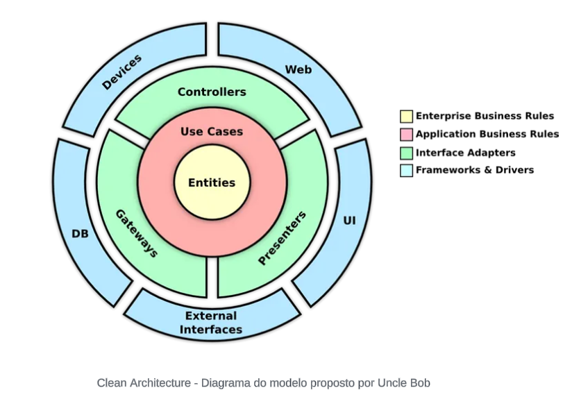
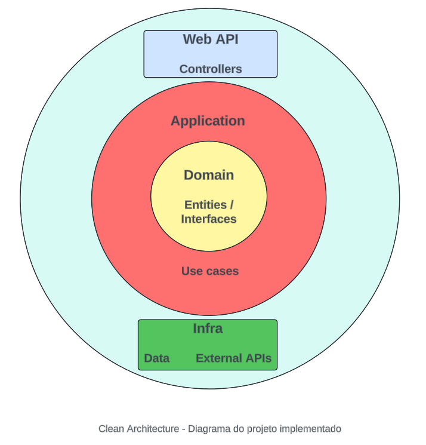
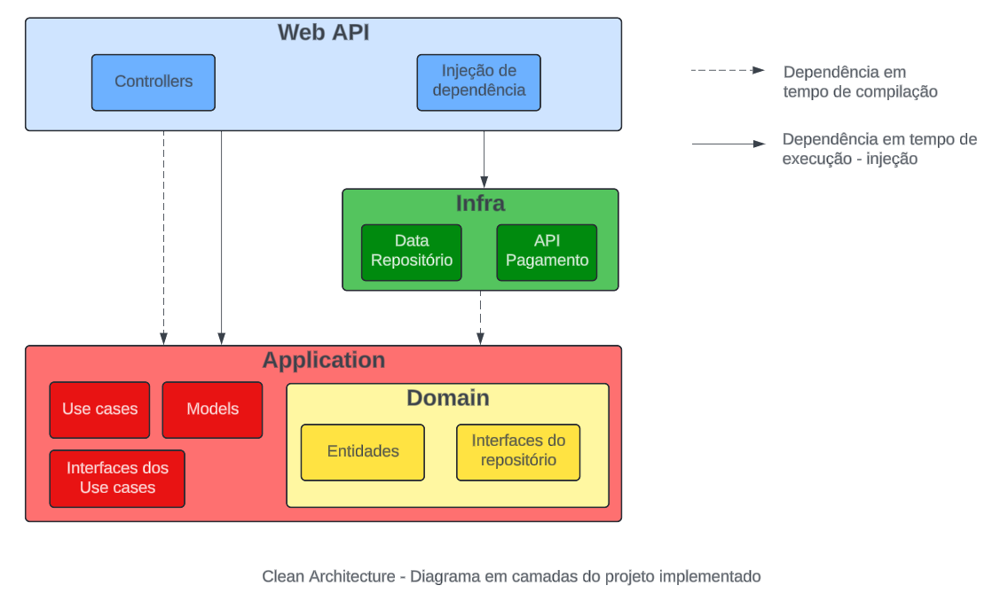

# Tech Challenge - FIAP - Grupo 12

## Descrição
Este repositório contém o código fonte de uma api de garenciamento para lanchonete, conforme desafio técnico proposto nas disciplinas de Arquitetura de Software da Pós Tech - FIAP. Esta API está desenvolvida em .NET 8, e tem por objetivo gerenciar as principais operações de uma lanchonete, considerando o cadastro de clientes, produtos, criação e acompanhamento de pedidos, e pagamentos.

## Fase 2 - Clean Architecture e Kubernetes

### a. Desenho da arquitetura 

i. Os requisitos do negócio (problema).
A arquitetura criada usou como base a arquitetura limpa (Clean Architecture) proposta por Robert Martin (Uncle Bob). A arquitetura referência segue abaixo:

<p align="center">
  &nbsp;&nbsp;&nbsp;&nbsp;&nbsp;&nbsp;&nbsp;&nbsp;&nbsp;&nbsp;&nbsp;&nbsp;&nbsp;&nbsp;&nbsp;&nbsp;&nbsp;&nbsp;&nbsp;&nbsp;&nbsp;&nbsp;&nbsp;&nbsp;&nbsp;&nbsp;
</p>

Esta é a forma como foi implementada no nosso projeto .Net:

<p align="center">
  
</p>

Esta é a forma representada em camadas como foi implementada no nosso projeto .Net

<p align="center">
  
</p>

ii. Os requisitos de infraestrutura - minikube

*[INCLUIR DIAGRAMA KUBERNETES AQUI]*

### b. APIs desenvolvidas:
b.i. Collection com exemplos de requisições - [Link do Swagger no projeto ou link para download da collection do Postman (JSON)](Documentação/Postman/FIAP.TechChallenge.ByteMeBurguer.API.postman_collection.json)

*[ATUALIZAR ARQUIVO E LINK]*

b.ii Ordem das requisições

### c. Guia completo com todas as instruções para execução do projeto e a ordem de execução das APIs
#### c.i Sequência de execução dos arquivos Kubernetes
*[INFORMAR A SEQUÊNCIA DE EXECUÇÃO DO KUBERNETES]*

### d. Link para vídeo demonstrando a arquitetura desenvolvida na nuvem ou localmente
[Vídeo](www.youtube.com)
*[INCLUIR LINK DO VÍDEO]*

Sequência do vídeo:

Parte 1 - Arquitetura limpa e projeto .Net ( https://drive.google.com/file/d/1GIBns0Mde1L8R0cQbMXKNrOJC_pNz8zb/view?usp=sharing )

Parte 2 - Exemplo do Postman e da sequência de requisições

Parte 3 - Arquitetura Kubernetes mostrando a criação dos elementos do Kubernetes e listando o que foi criado (PODs, Services, etc) e mostrando o HPA (Horizontal POD Autoscalling) funcionando.

## Fase 1 (finalizada) - Inicialização

### Pré-Requisitos
- Docker
- .NET SDK
- Opcionalmente, uma IDE como o Visual Studio ou VSCode


### Configuração
1. Clone o repositório:
   ```bash
   git clone https://github.com/HenriqueSantos1994/TechChallenge.git
    ```

2. Inicie o serviço utilizando Docker:

   ```bash
    docker-compose up -d
   ```

3. Acesse o swagger da aplicação para ter acesso a todos os endpoints

   > [http://localhost:5001/swagger/index.html](http://localhost:5001/swagger/index.html)


4. Para finalizar o serviço utilizando docker, execute:

   ```bash
    docker-compose down
   ```

### Collections
//TODO: Insere guia das coleções do postman
